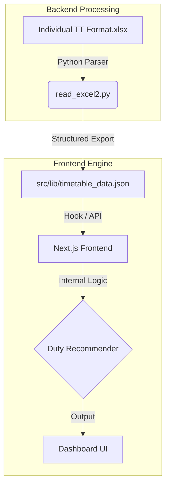

# ChronosGrid 🗓️

**ABES GO** is an advanced college timetable management system designed to streamline faculty scheduling, duty allocations, and workload optimization.

Built with a hybrid architecture of Python and Next.js, it transforms complex Excel schedules into an interactive, date-aware dashboard for administrators and faculty.

---

## 🏗️ Architecture

The system follows a reactive data pipeline, moving from unstructured Excel files to an optimized web interface:



### Core Components

1. **Excel Parser (Python):** Uses `pandas` and `openpyxl` to extract complex timetable grids.
2. **Logic Layer (TypeScript):** Located in `src/lib/data.ts`, it calculates real-time workload scores and "heavy duty" statuses.
3. **Modern UI (Next.js):** A premium, glassmorphic interface for managing schedules and viewing faculty load.

---

## 🚀 Getting Started

### Prerequisites

- **Node.js:** v18 or higher.
- **Python:** 3.8 or higher (with `pandas` and `openpyxl`).

### Setup Instructions

#### 1. Frontend Setup

```bash
cd time-table-next
npm install
npm run dev
```

#### 2. Data Synchronization

To refresh the timetable data from the Excel master file:

- Ensure the `.xlsx` file is in the root directory.
- Use the **Sync** feature in the web dashboard (which calls the `/api/sync-excel` endpoint).
- Alternatively, run the script manually:

  ```bash
  python read_excel2.py
  ```

---

## ✨ Features

- **Real-time Availability:** Instantly see who is free for a specific time slot.
- **Workload Scoring:** Automated calculation of teaching load (Lectures, Tutorials, Practicals).
- **Duty Recommendations:** Smart suggestions for faculty duties based on current availability and cumulative stress levels.
- **Glassmorphic Design:** A premium dark-mode interface for better user experience.

---

## 👥 Collaboration

This project is open for collaboration! If you are working on the project:

1. Update the **Excel Master** file as needed.
2. Run the Python sync script to update the JSON data store.
3. Implement UI features in `src/app`.

---

### Phase: Development | Version: 1.0.0
